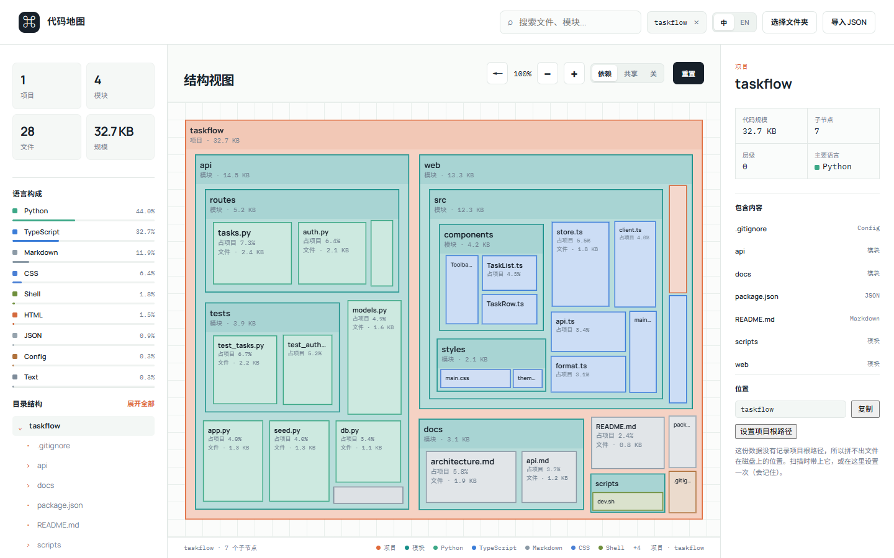
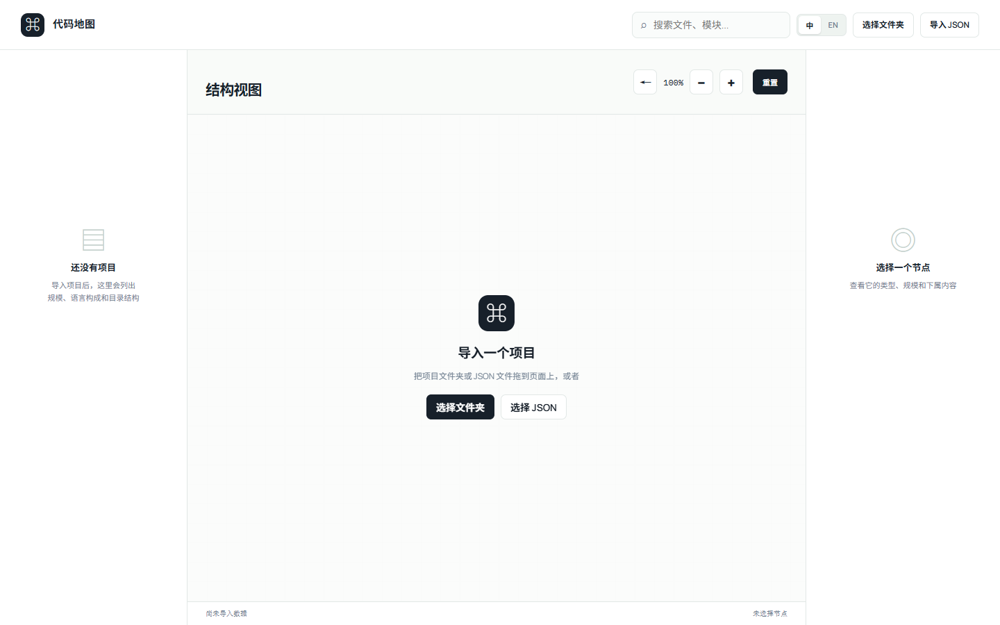
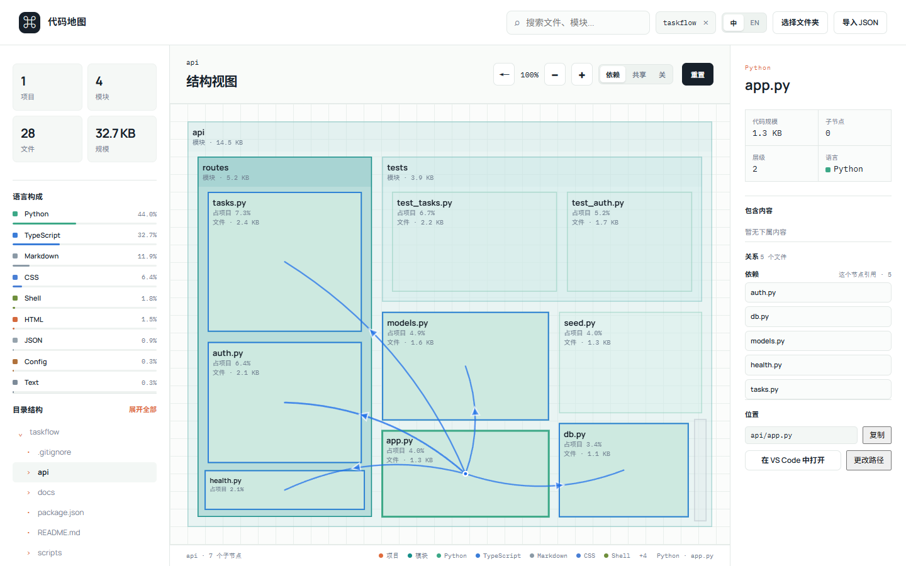

# Code Atlas

**A treemap of a codebase where area is code size.** Drop a folder onto the page, or scan it from the command line — no install, no build step, and nothing that parses your source.



Every tile is a file or a directory. Its area is how much code is in it, its colour is the language or the kind of thing it is, and its label always fits: a tile that runs out of room drops a line instead of clipping one.

**Try it:** [live demo](https://BEIDAKULEWUWUWU.github.io/code-atlas/viewer/index.html). It opens empty — drag your own project folder onto the page and it is scanned in the browser. Nothing is uploaded.

---

把项目的结构和代码规模画成一张图。方块是文件或目录，**面积正比于代码量**，按语言上色，文字放不下就少画一行，而不是裁掉。

## 开始

```bash
npm start          # http://localhost:8123/viewer/index.html
```

也可以什么都不装：[在线版](https://BEIDAKULEWUWUWU.github.io/code-atlas/viewer/index.html)打开是空的，把你的项目文件夹拖进去就行 —— 查看器是个静态页面，整份工具都由 GitHub Pages 托管，扫描在你自己的浏览器里完成，不上传任何东西。

导入有四种方式：点「选择文件夹」、把文件夹拖到页面上、点「导入 JSON」，或者用命令行扫（下一节）。**页面不会自动打开任何示例**，一开始是空的，等你导入。



## 命令行扫描

大项目推荐，扫一次存成 JSON：

```bash
node tools/scan.js ../my-project --out my-project.json
```

| 选项 | 说明 |
|---|---|
| `--out <文件>` | 写到这里，默认 stdout |
| `--name <名字>` | 根节点名字，默认取目录名 |
| `--all` | 连 `node_modules`、`dist` 一起扫 |
| `--ignore <名字>` | 跳过某个文件或目录，可写多次，**压过 `--all`** |
| `--max-depth <n>` | 深度上限，默认 24 |
| `--no-root-path` | 不记录被扫描目录的绝对路径 |
| `--no-relations` | 只算面积和颜色，不读文件内容 |
| `--quiet` | 只报错 |

进度报告走 stderr，数据走 stdout，所以 `node tools/scan.js . > tree.json` 得到的是干净的 JSON，不是混了报告的垃圾。报告里的数字是从写出去的那棵树里读回来的，表头和图上看到的一定对得上。`node_modules`、`.git`、`dist`、`__pycache__`、`target`、`vendor` 这类目录默认跳过（完整名单见 [app.js](viewer/app.js) 的 `SKIP_DIRS`）。

扫完会打印一行可以直接打开的地址（`?data=…` 参数，相对路径或别的服务上的地址都行）。

扫描的目录会写进 JSON 的 `rootPath`，图上的方块因此能双击交给编辑器打开源文件。要把数据提交进仓库或发给别人，就加 `--no-root-path` —— 那是你自己机器上的目录结构，没必要跟着数据走。

## 关系

面积和颜色回答「这个项目有多大」，关系层回答**「改这里会牵连到谁」**。选中一个方块，它牵着的方块亮起来，其余压暗，并从它拉出线来。两个信号：

- **依赖** —— 谁 import 谁。有方向，箭头指向被 import 的那一方；一条线两头都有箭头，就是互相引用。
- **共享** —— 两个文件里出现了同一个字符串，通常是接口地址、事件名或数据字段这类契约。没有方向，所以不画箭头。



**只在选中时出现。** 平时地图上没有任何装饰；选中一个跟谁都没关系的文件，图一点都不会变暗。

**方向是这一层最要紧的一个字。**「我 import 了 config」和「config 被我 import」的处置是相反的：前者随便改，后者说明屏幕外每一个这样的文件都是要检查的调用点。所以箭头指向被依赖的一方，右侧「关系」一栏也按「依赖」「被依赖」「共享」分三组列出伙伴 —— 出现在两组里的是循环，不是重复。共享边一个箭头都没有：箭头得有地方可指，而「两个文件都提到同一个名字」没有指向性。

**权重是倒数的。** 两个文件都提到一个名字，权重是 1；十个文件都提到，两两之间是 1/9。再往上有道闸：出现在超过 30%（至少 3 个）文件里的名字直接丢掉，报告里 `vocabulary` 一行会列出前几个。这样一条只属于两个文件的私有约定不会被共享词汇淹没，而共享词汇也没有被删掉 —— 它只是排在后面。

**接口地址会被折叠。** 客户端写的 `http://localhost:8000/api/tasks` 和服务端写的 `/api/tasks` 是同一个东西的两面，把协议和域名折掉，这两条边才会接上 —— 不折的话，一个前后端项目里最重要的那条边是隐形的。

**这一层是猜的，不是解析器。** 它不执行代码、不读 `tsconfig.json`、不认识打包器别名（`@/components/x` 解析不出来，也就不产生边）。共享信号靠字符串共现，两个文件提到同一个常见名字可能纯属巧合，倒数和上限在压这件事，但压不干净。**少一条边是看得见的（那里没有线），错一条边看不出来** —— 请当线索读，不要当依赖图的证明。

## 数据格式

```json
{
  "name": "my-project",
  "type": "project",
  "size": 120,
  "rootPath": "D:/work/my-project",
  "children": [
    { "name": "src", "type": "module", "size": 90, "children": [
      { "name": "index.js", "type": "file", "size": 12, "lang": "JavaScript" }
    ] }
  ],
  "relations": [
    { "from": "src/index.js", "to": "src/util/helpers.js", "kind": "import", "weight": 1 },
    { "from": "src/api.js", "to": "server/routes.py", "kind": "shared", "weight": 1, "labels": ["/api/tasks"] }
  ]
}
```

- `type` 取 `project` / `module` / `file`，只影响配色和标签文字。**省略或写成别的词也行** —— 会按结构推断：有子节点就是 `module`，没有就是 `file`，最外层是 `project`。手写和转换来的 JSON 常常只给文件写了 `type` 而漏掉目录。
- `size` 单位是 KB，**可以是小数**。缺省、为 0 或为负时回退为子节点之和，再没有就按 0 处理。`lang` 可省略，省略时按 `name` 的后缀推断。`children` 可省略，即叶子。
- `rootPath` 是被扫描目录的绝对路径，用来把方块拼成可以打开的链接；省略就没有跳转。
- `relations` 里 `from` / `to` 是**项目相对路径**（不是名字，所以同名的文件不会混）。`kind` 取 `import` 或 `shared`，`weight` 决定线的粗细和深浅，`shared` 边可以带 `labels`。**没有这一项时，工具栏上的关系开关不出现** —— 一个手写的 JSON 不会给出一排点了没反应的按钮。

> **`size` 为什么是小数。** 扫描器保留一位小数，下限 0.1 KB。按整 KB 取整的话，一个 300 字节的文件会变成 0 KB，而面积正比于 `size` —— 所有小文件会挤成同样大小，图上再也分不出谁大谁小。所以状态栏里偶尔会看到 `0.1 KB`。

## 其他操作

- **缩放**：滚轮或右上角 `−` / `+`，35% 到 800%。滚轮以光标为锚点，光标底下那个点不会跑。放大不重排布局，也不会把标签变成放大的位图 —— 文字按屏幕像素绘制，所以放大能救回原本放不下的名字、占比和大小。
- **跳到代码**：单击选中，右侧「位置」给出项目相对路径和复制按钮；**双击一个文件方块**，或选中后按 `Enter`，交给编辑器打开（一个 `vscode://file/…` 链接，VS Code、Cursor、VSCodium 都认）。「选择文件夹」和拖放拿不到绝对路径 —— 浏览器的 File API 不给 —— 所以那条路右侧会给出设置入口。
- **颜色**：叶子按语言，容器按类型。「其他」是中性灰：它不是一个语言，而是一堆没有共同语言的文件的集合。颜色从来不是唯一的信息通道，图例、浮层和右侧详情栏都把语言写成文字。
- **界面语言**：顶栏右侧的 `中` / `EN` 切换中文和英文。第一次打开跟浏览器语言走，之后记住你的选择；`?lang=en` 可以指定某一次打开的界面语言，且不会改掉已记住的选择。界面语言只改界面 —— 文件名、项目名和 `lang` 字段的值（包括「其他」）保持原样。

## 校验

```bash
npm run check      # 模型、关系、布局、扫描器、界面文字、文档，124 项，不需要浏览器
```

加上 `--url` 会对运行中的页面做像素级检查（需要 Chrome 开着 `--remote-debugging-port=9222`）：

```bash
node viewer/tools/check.js --url http://localhost:8123/viewer/index.html
```

分两层是刻意的。**纯层**把 [app.js](viewer/app.js) 里 `@model:pure`、`@graph:pure`、`@layout:pure`、`@i18n:pure` 四个标记区之间的函数抽出来，在 node 里回放，断言的是计算本身；**像素层**通过 CDP 读回画布像素，断言的是计算真的画到了屏幕上 —— 一个计划只是意图，不是结果。两条路走的是同一份代码，所以新增一种扩展名或修一条关系规则只需要改一处。

界面文字和布局数学是分开的，而且是**被检查固定住的**：`@layout:pure` 区里一个中文字符都不许有，所以界面语言永远进不了布局计算，也就永远漏不进 [tools/scan.js](tools/scan.js) 扫出来的 JSON（`lang` 字段里的「其他」是数据，切到英文也还是「其他」）。多一条翻译只要两边表里同时加，加漏了会红。

## 目录

| 路径 | 说明 |
|---|---|
| [viewer/](viewer/) | 查看器本体。[app.js](viewer/app.js) 单文件零依赖，无构建步骤 |
| [viewer/tools/check.js](viewer/tools/check.js) | 校验脚本，仅开发用，运行时不会加载 |
| [viewer/tools/shot.js](viewer/tools/shot.js) | README 截图的生成脚本，仅开发用 |
| [tools/serve.js](tools/serve.js) | 零依赖静态服务器 |
| [tools/scan.js](tools/scan.js) | 命令行扫描器，把一个目录变成一张图 |
| [samples/taskflow/](samples/taskflow/) | 一个编出来的小项目，上面几张图就是扫它生成的 |
| [samples/polyglot/](samples/polyglot/) | 15 种语言的样本目录，用来看多语言配色 |
| [sample-project/](sample-project/) | 一个可运行的小项目，用来生成真实数据试手 |

## 已知限制

- **超过 12 层，或内容区小于 44×26px，就不再往下画**，状态栏会写「已显示 N/M」。这些节点仍可从左侧目录树和面包屑进入。
- **方块太小就不画字。** 名字、占比、类型三行按剩余高度逐级丢弃，名字最后丢；连名字都放不下就整块不画字，而不是把字裁一半。这时可以把鼠标停在方块上（浮层给出完整名字、类型、大小和占比），或者放大。
- **数字永远不会被截断成半个。** 名字截断成 `package.js…` 仍然指得明那个文件，`占项目 1.…` 却不能 —— 它可能是 1.1% 也可能是 19%。所以数字放不下就整行不画，完整值在浮层和详情栏里。
- **兄弟数量极多时最小的方块会变细。** 面积仍然精确，但 100:1 以上的权重差会让最小的方块长成细条 —— 那是该矩形下 squarify 的最优解，不是 bug。
- **关系要读文件内容，所以有代价也有边界。** 二进制、图片、字体、证书、lockfile 这类语言直接跳过，单文件超过 512 KB 的也不读；这些文件照常出现在图上（面积和颜色一个不少），只是不参与关系。
- **20 种语言的颜色并不能两两分清。** 方块是调色板色叠在白底上的，整体被压向浅色，有几对肉眼几乎一样 —— 最接近的 Markdown / JSON 相差 ΔE 0.9。颜色始终只是辅助通道，语言的名字在图例、浮层和左侧面板里都是文字。

## 许可

[MIT](LICENSE)。拿去用、改、商用都行，保留版权声明即可。
